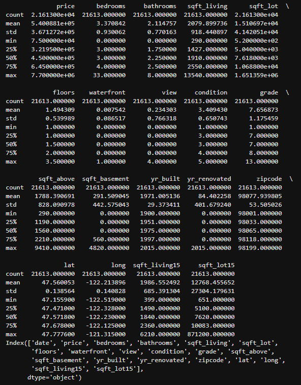
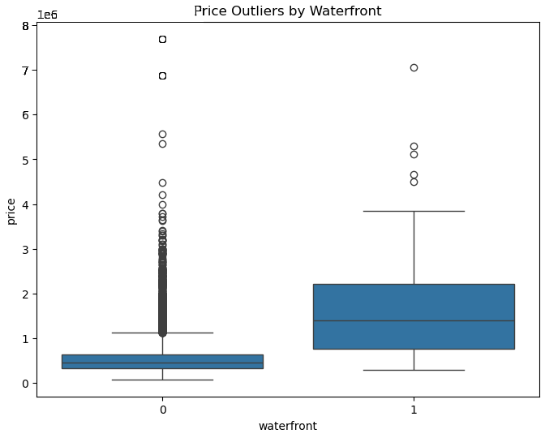

# House Sales Analysis 🏠📊

## Project Overview 🌟
This project analyzes house sales data in King County, USA.  
It uses Python libraries such as **pandas**, **numpy**, **matplotlib**, **seaborn**, and **scikit-learn** to explore, process, and model the data.

هذا المشروع يحلل بيانات مبيعات المنازل في **مقاطعة كينج، الولايات المتحدة الأمريكية**.  
تم استخدام مكتبات **Python** مثل **pandas**، **numpy**، **matplotlib**، **seaborn** و **scikit-learn** لاستكشاف البيانات ومعالجتها وبناء نموذج للتنبؤ بالأسعار.

---

## Data Overview 📁
- Dataset: `kc_house_data.csv`  
- Features include: `sqft_living`, `bedrooms`, `bathrooms`, `floors`, `sqft_lot`, `sqft_above`, `sqft_living15`, `waterfront`, `view`, `grade`, `lat`  
- Target: `price`

### نظرة عامة على البيانات
- الملف: `kc_house_data.csv`  
- الخصائص تشمل: `sqft_living`, `bedrooms`, `bathrooms`, `floors`, `sqft_lot`, `sqft_above`, `sqft_living15`, `waterfront`, `view`, `grade`, `lat`  
- الهدف: التنبؤ بـ `price`

---

## Data Cleaning & Preprocessing 🧹
- Dropped unnecessary columns: `id`, `Unnamed: 0`  
- Handled missing values  
- Checked data types with `dtypes`  
- Explored statistical summary using `describe()`  

- إزالة الأعمدة غير الضرورية: `id` و `Unnamed: 0`  
- معالجة القيم المفقودة  
- عرض أنواع البيانات باستخدام `dtypes`  
- الحصول على ملخص إحصائي باستخدام `describe()`  

---

## Exploratory Data Analysis 📊
- Count of houses per number of floors using `value_counts()`  
- Boxplot for price outliers by `waterfront`  
- Regression plot between `sqft_above` and `price`  

- عد المنازل حسب عدد الطوابق باستخدام `value_counts()`  
- رسم Boxplot لتحديد القيم الشاذة حسب `waterfront`  
- رسم الانحدار بين `sqft_above` و `price`  

---

## Modeling & Prediction 🤖
- Linear Regression using single feature: `sqft_living`  
- Linear Regression using multiple features:  
  `["floors","waterfront","lat","bedrooms","sqft_basement","view","bathrooms","sqft_living15","sqft_above","grade","sqft_living"]`  
- Polynomial Regression with Pipeline (scaling + degree=2)  
- Ridge Regression (alpha=0.1)  
- Ridge Regression with Polynomial Transform (degree=2)  

- نموذج الانحدار الخطي باستخدام خاصية واحدة: `sqft_living`  
- نموذج الانحدار الخطي باستخدام عدة ميزات:  
  `["floors","waterfront","lat","bedrooms","sqft_basement","view","bathrooms","sqft_living15","sqft_above","grade","sqft_living"]`  
- الانحدار متعدد الحدود باستخدام Pipeline (توحيد القياس + درجة 2)  
- Ridge Regression (alpha=0.1)  
- Ridge Regression مع تحويل Polynomial (درجة 2)  

- Model evaluation using **R²** metric  

- تقييم النموذج باستخدام مقياس **R²**  

---

## Screenshots 📸
All screenshots are inside the `Screenshots/` folder:

-  → Data types of columns / أنواع البيانات لكل عمود  
-  → Statistical summary / الملخص الإحصائي  
-  → Number of houses per floor / عدد المنازل حسب الطوابق  
-  → Price outliers by waterfront / القيم الشاذة حسب الواجهة البحرية  
-  → sqft_above vs price / العلاقة بين sqft_above والسعر  

---

## Usage 💻
1. Open `House_Sales_Analysis.ipynb` in **Jupyter** or **Google Colab**  
2. Run all cells to perform data cleaning, exploration, modeling, and visualizations  

1. افتح الملف `House_Sales_Analysis.ipynb` في **Jupyter** أو **Google Colab**  
2. شغّل جميع الخلايا لرؤية تنظيف البيانات، الاستكشاف، بناء النموذج، والرسوم البيانية  

---

## Notes 📝
- Analysis is done using Python libraries  
- Visualizations are created with **matplotlib** and **seaborn**  
- Model evaluation uses **scikit-learn** metrics  

- جميع التحليلات تمت باستخدام مكتبات Python  
- الرسوم البيانية تم إنشاؤها باستخدام **matplotlib** و **seaborn**  
- تقييم النموذج باستخدام مقاييس **scikit-learn**  

---

## Files Included 📂
- `House_Sales_Analysis.ipynb` → Jupyter Notebook with full analysis / النوتبوك الكامل للتحليل  
- `kc_house_data.csv` → Dataset / ملف البيانات  
- `Screenshots/` → Folder containing all screenshots / مجلد يحتوي على جميع لقطات الشاشة
